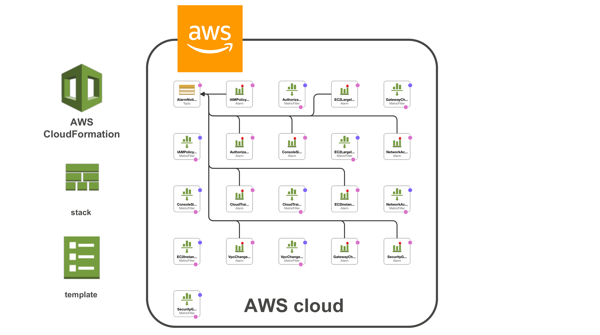

# Useful AWS CloudWatchAlarms

## Infrastructure



## About
After you configure your CloudTrail to deliver log files to your CloudWatch log group, you can create CloudWatch metric filters and alarms to monitor the events in the log files. These alarms will alert you to most of the mutating actions that occur in your AWS environment. For example, you can specify an event such as the Amazon EC2 RunInstances operation, so that CloudWatch sends you notifications when that event occurs in your account. You can create your filters and alarms separately or use the AWS CloudFormation template to define them all at once.

The CloudFormation template has predefined CloudWatch metric filters and alarms, so that you receive email notifications when specific security-related API calls are made in your AWS account. The template defines metric filters that monitor create, delete, and update operations for the following resource types:

- Amazon EC2 instances
- IAM policies
- Internet gateways
- Network ACLs
- Security groups

When an API call occurs in your account, a metric filter monitors that API call. If the API call exceeds the thresholds that you specify, this triggers the alarm and CloudWatch sends you an email notification.

By default, most of the filters in the template trigger an alarm when a monitored event occurs within a five-minute period. You can modify these alarm thresholds for your own requirements. For example, you can monitor for three events in a ten-minute period.

*NOTE:* The base CloudFormation template was taken from the [AWS Documentation Website](https://docs.aws.amazon.com/awscloudtrail/latest/userguide/use-cloudformation-template-to-create-cloudwatch-alarms.html). The site was where this teamplate began, but it will continue to grow as more useful alarms are discovered to have in an account.

## Usage

1. Edit the CloudFormation template and replace the "<YOUR-EMAIL-HERE>" field with the email you want the alarms to send the SNS Topic to.

``` BASH
sed s/'<YOUR-EMAIL-HERE>'/'your@email.com' CloudWatchAlarms.yaml
```

2. Upload the CloudFormation template to the [CloudFormation Console](https://console.aws.amazon.com/cloudformation/home)
